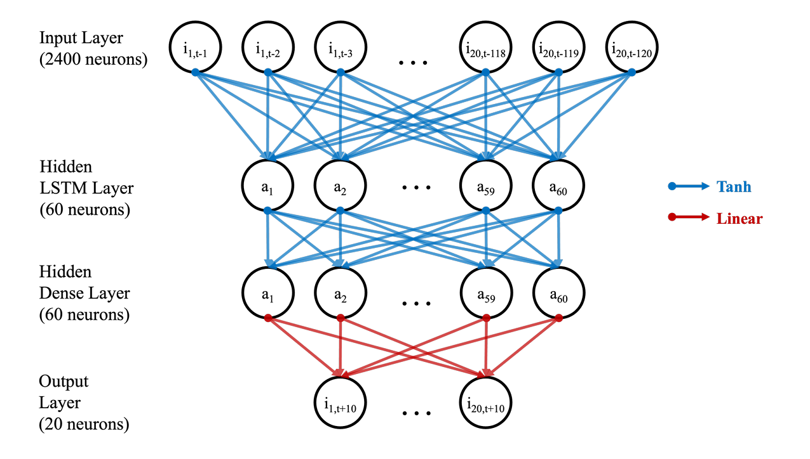
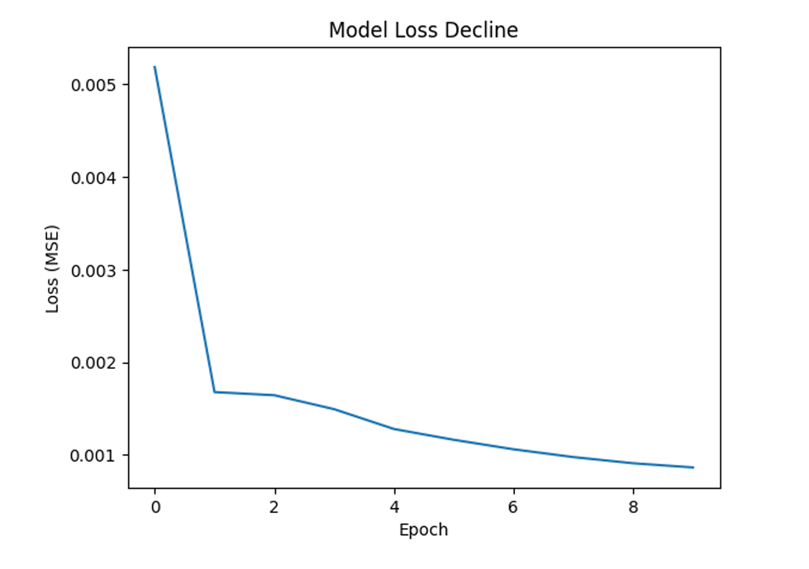
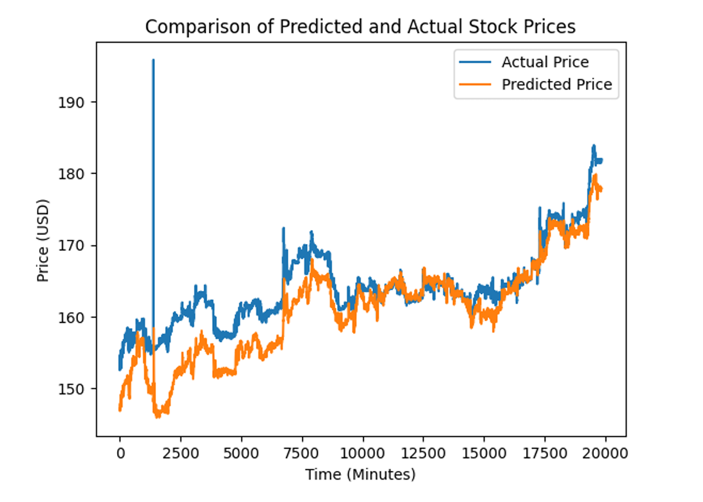
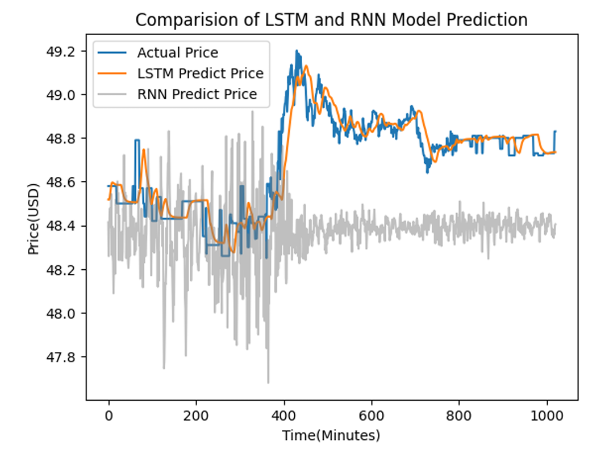

# LSTM Neural Network for Multi-Stock Price Prediction

A deep learning model for intraday stock price forecasting using Long Short-Term Memory (LSTM) neural network design. It is useful for real-world short-term price prediction with 61% bidirectional accuracy 10 minutes into the future for selected technology stocks.

I developed this project in collaboration with 3 others during an internal hackathon for AI project creation. We prioritized technical development with methodological justification, creating a report detailed in project_report.md.

## Project Overview

This project implements a multi-stock prediction system that forecasts intraday stock prices using historical time series data. The model employs LSTM neural networks to capture complex temporal dependencies in financial markets and uses automated hyperparameter tuning to optimize prediction accuracy.

### Key Achievements

- **Multi-Stock Prediction**: Simultaneous forecasting of 30 stock prices using a single unified model
- **Model Accuracy**: Successfully predicts price movement direction with 61% bidirectional accuracy (significantly above 50% random chance)
- **Temporal Architecture**: Utilizes 10-step lookback windows to predict prices 3 steps ahead (configurable)
- **Optimized Performance**: Grid search across 27 hyperparameter combinations using 3-fold cross-validation
- **Fast Inference**: 13-second prediction runtime enables real-time trading applications

## Model Architecture

### LSTM Network Structure

The neural network consists of:

- **Input Layer**: Sequences of historical stock prices (shape: 10 timesteps × 30 features)
- **LSTM Layer 1**: 60 neurons with sigmoid activation, return sequences enabled
- **Dropout Layer**: 0.2 dropout rate for regularization and overfitting prevention
- **LSTM Layer 2**: 60 neurons with sigmoid activation, no return sequences
- **Dense Output Layer**: Fully connected layer outputting predictions for all 30 stocks



### Model Configuration (Optimized)

Based on comprehensive grid search results:
- **LSTM Neurons**: 60 (optimal from [50, 60, 70])
- **Activation Function**: Sigmoid (optimal from ['relu', 'tanh', 'sigmoid'])
- **Optimizer**: Adam (optimal from ['adam', 'rmsprop', 'sgd'])
- **Training Epochs**: 200 with early stopping potential
- **Batch Size**: 32
- **Loss Function**: Mean Squared Error (MSE)

## 📊 Data Pipeline & Preprocessing

### Data Processing Steps

1. **Data Loading**: Supports CSV format stock price datasets
2. **Temporal Split**: 80/20 train/test split maintaining chronological order
3. **Normalization**: MinMax scaling to [0,1] range for stable training
4. **Sequence Generation**: Sliding window approach creating supervised learning samples
5. **Inverse Transformation**: Converts normalized predictions back to original price scale

### Dataset Structure

```python
# Example data structure for 30 stocks
dataframe.shape  # (time_periods, 30_stocks)
# Features: Historical closing prices for each stock
# Target: Future prices 3 steps ahead
```

## 🔬 Experimental Results

### Model Performance Metrics

- **Overall MSE**: 72.82 across all 30 stocks
- **Direction Prediction**: 61% accuracy in price movement direction
- **Training Convergence**: Clear loss reduction over 200 epochs
- **Model Parameters**: 2,432 trainable parameters

### Visual Analysis

#### Training Performance

*Training and validation loss curves showing model convergence*

#### Prediction Quality

*Comparison of actual vs predicted stock prices demonstrating trend capture*

#### Architecture Comparison

*Performance comparison showing LSTM superiority over traditional RNN*


##  Model Validation & Insights
### Theoretical Foundation

The model addresses key challenges in financial time series:

1. **Vanishing Gradient Problem**: LSTM's gated architecture maintains long-term dependencies
2. **Non-linear Patterns**: Deep learning captures complex market relationships
3. **Multi-variate Dependencies**: Simultaneous modeling of multiple stocks captures market correlations
4. **Temporal Dynamics**: Recurrent structure preserves sequential information

### Performance Analysis

- **Trend Capture**: Successfully identifies general market direction and patterns
- **Practical Feasibility**: 13-second inference time enables real-time applications
- **Statistical Significance**: 61% directional accuracy significantly exceeds random chance
- **Convergence**: Clear training stability with proper regularization

### Limitations & Considerations

1. **Sample Scope**: Limited to IT sector stocks (20-30 stocks)
2. **Computational Constraints**: Grid search optimization limited by available computing resources (our team had access to limited computers)
3. **Feature Engineering**: Uses only price data; could benefit from technical indicators
4. **Market Efficiency**: Acknowledges random walk theory challenges in high-frequency prediction

## Future Enhancements

### Immediate Improvements
- **Real-time Data Integration**: API connections for live stock feeds
- **Technical Indicators**: RSI, moving averages, volume, and momentum features
- **Advanced Optimization**: Bayesian or genetic algorithm hyperparameter search
- **Ensemble Methods**: Combining multiple models for improved robustness

### Research Extensions
- **Attention Mechanisms**: Transformer-based architectures for enhanced temporal modeling
- **Convolutional Networks**: Processing candlestick chart images as alternative input
- **Risk Metrics**: Portfolio optimization and risk-adjusted return calculations
- **Market Regime Detection**: Adaptive models for different market conditions

## Academic Context

This project demonstrates practical applications of:

- **Financial Machine Learning**: LSTM networks for time series forecasting
- **Hyperparameter Optimization**: Systematic grid search methodology
- **Deep Learning for Finance**: Non-linear pattern recognition in market data
- **Temporal Modeling**: Sequence-to-sequence prediction architectures

## 📄 Additional Resources

- **Technical Report**: `project_report.md` - Comprehensive academic analysis
- **Implementation**: `final_Project_code.ipynb` - Complete code with grid search
- **Results**: `grid_result_combined.xlsx` - Detailed hyperparameter optimization outcomes

---

*This project serves as a foundation for advanced stock prediction research and demonstrates the potential of deep learning in financial forecasting while maintaining awareness of market efficiency principles.*
