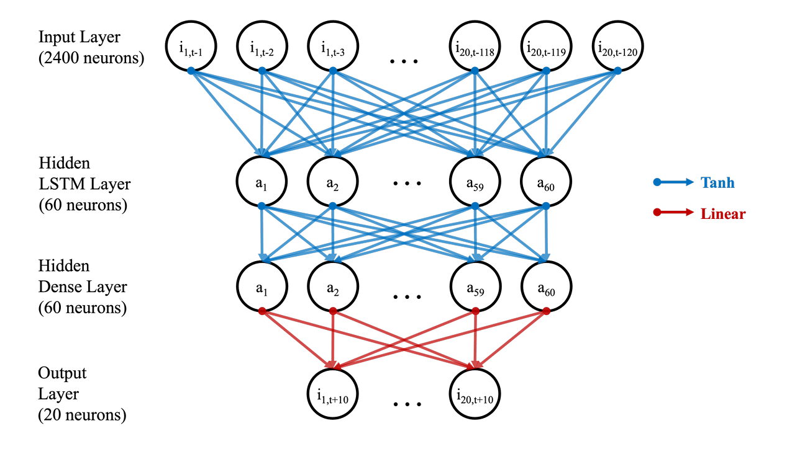
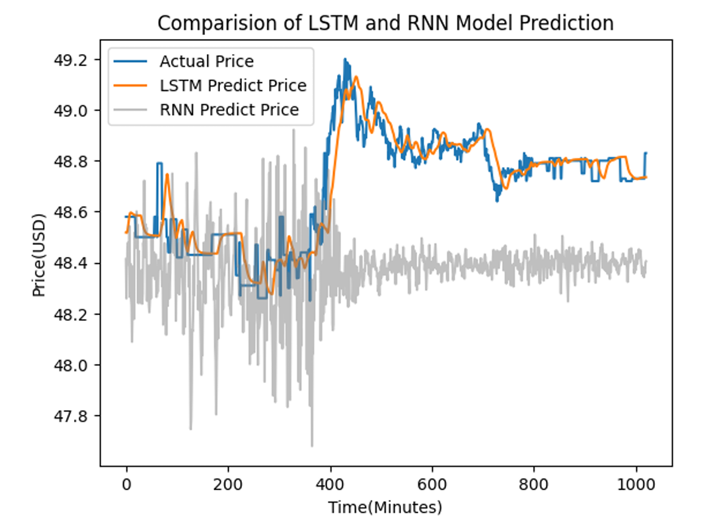
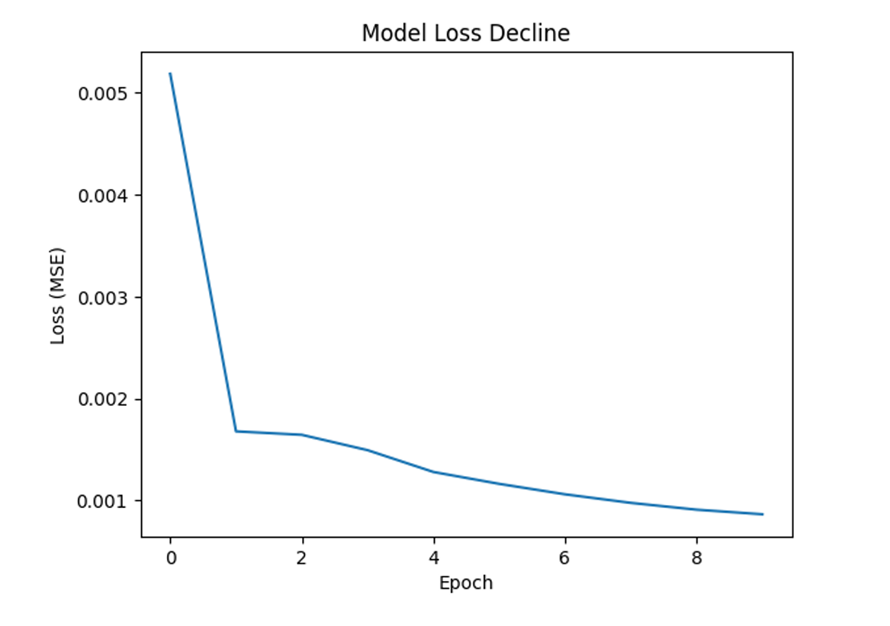
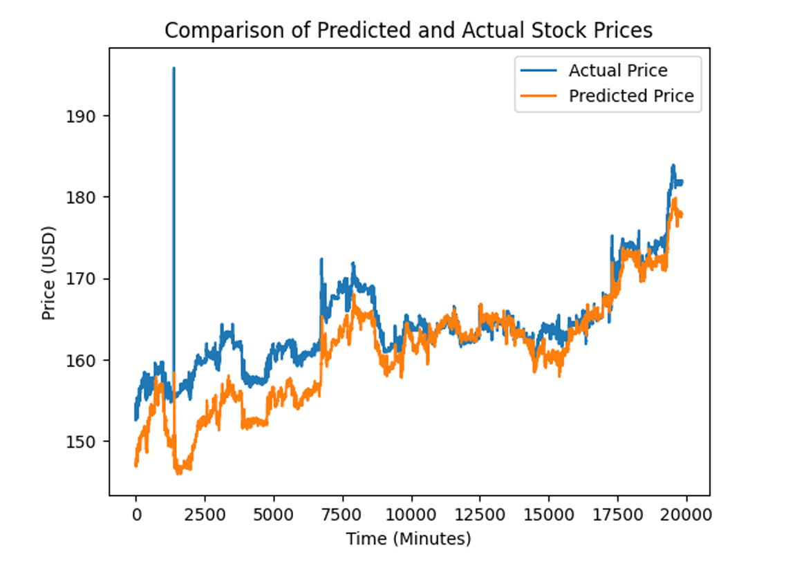

# Multi-Stock Neural Network for Price Prediction

## Abstract

This research investigates the effectiveness of Long Short-Term Memory (LSTM) neural networks in forecasting intraday stock prices based on historical price data. It draws on past findings in model design, and utilises a grid search technique for optimising model hyperparameters. The proposed model predicts the direction of price movement with considerable accuracy (61%), yet its accuracy of price prediction is comparatively limited. This study serves as a proof of concept into the capability of LSTM models for stock price prediction. Furthermore, the findings imply that more efficient hyperparameter optimisation strategies may increase model accuracy.

## 1 Introduction

Stock price prediction is a time series modelling problem – the goal is to fit a model that describes
the underlying pattern or structure of the time series by studying historical observations. As such, an
appropriate model should be able to generate predictions of future values. Forecasting is important
in any field that involves time-dependent data, and is particularly indispensable to financial markets.
The existing methods for price forecasting in stock markets can be categorised into linear and nonlinear
algorithms.

Linear models are the orthodox approach to forecasting problems and owe its popularity to its
simplicity and flexible application to different time series. ARIMA model and its subclass models like
AR and MA take the assumption that the time series is linear and has a known statistical distribution
(e.g., normal distribution) [?]. The main limitation of this approach is its presupposition of linearity,
which can become inadequate if the underlying time series is non-linear. Nonlinear models such
as NMA [?] or ARCH and its associated algorithms [?] address this issue by, accordingly, either
introducing non-linearity in mean, or non-linearity in variance, but make trade-offs in terms of ease
of implementation.

A deep learning model for stock price prediction is an approach that could overcome these challenges. 
Artificial neural networks have the capability to fit models without a priori assumptions about
the underlying statistical distribution. Since the approximation is adaptively formed based on the
given data, it can deal with more flexible functional forms than traditional statistical models [?]. This
makes neural networks uniquely suited for problems that are hard to specify but have abundant data
[?,?]. Most importantly, neural networks have the capability to generalise. After training with a
dataset (i.e., historical prices), it should be able to make correct inferences about the unseen part of
the data (i.e, future prices). Therefore, in theory, neural networks should be a suitable approach for
forecasting stock prices.

Papers on the application of deep learning for stock forecasting propose a number of different
neural network architectures. Recurrent neural networks (RNNs) are largely the preferred type of
neural network for handling time series data [?] because the recurrent cells have feedback loops that
address the temporal dependencies of the sequence [?]. An overview of recent RNN-based stock price
forecasting attempts [?] identify a corpus of models that use LSTM (Long Short-Term memory) units
or in combination with other kinds of RNN units. Following from this, this paper replicates an existing
approach to LSTM modelling, comparing to available models. It contributes a novel grid-based search
method for hyperparameter validation which draws on existing studies.

## 2 Problem Formulation

RNNs are a class of neural networks suited to processing time series data. They can keep information
along time, storing it in hidden variable h which is updated based on new inputs. This allows the
output to be computed with the hidden variable [?]:

For the RNN depicted in Figure 1, we outline here the corresponding equations from [?]. 
Supposing we have the sigmoid function as our activation function (this is variable), our output o
will take the value of the predicted price. Since our output is not discrete, it does not necessitate a
post-processing step. Our ŷ is equivalent to our output. Hence, for all time t:

a(t) = b + Wh·h(t-1) + Wx·x(t)         (1)
h(t) = σ(a(t))                         (2)
o(t) = c + Wy·h(t)                     (3)
ŷ(t) = o(t)                            (4)

where for the weight matrices, Wx is input-to-hidden, Wh is hidden-to-hidden, Wy is hidden-
to-output connections; b and c are bias vectors given by the hyperparameters. We will explore its
implications in section 3. Since we are concerned with the difference between ŷ and y, the loss function
should take a form such as mean squared error:

MSE = (1/N) · Σ(yi - ŷi)²              (5)

As price forecasting concerns the learning of long-term dependence series, the issue with 'vanilla'
RNN is that gradients propagated over many stages often vanish (i.e., the gradient of the loss function
approaches zero), making training the model difficult. Therefore, for time-series modelling, the most
effective units are gated RNNs: LSTM [?] and GRU (Gated Recurrent Unit) [?]. These units address
the vanishing gradient problems by having connection weights that are manually chosen constants
or values of parameters, which allows the network to retain information over a duration. However,
once the information is used, it might be practical to forget the old state if the information is no
longer necessary. Essentially, we want the neural network to learn when it is appropriate to forget
[?]. Hochreiter and Schmidhuber (1997) introduced the idea of create paths where the gradient may
flow for longer durations by making the weight of the self-loop gated (i.e., determined by a separate
hidden unit), allowing the time scale of integration dynamic instead of static as in vanilla RNN. LSTM
structure is represented in Figure 2 below.

The work of each LSTM unit can be divided into three parts: forgotten gate, input gate, and
output gate. The equations are as follows:

1. Forget gate: Historical information that is judged as useless or irrelevant will be discarded by the
forgotten gate

f(t) = σ(Wf × (h(t-1), x(t)) + bf)     (6)

2. Input gate: The information retained by the forget gate is combined with the new input then
transmitted to the output gate

i(t) = σ(Wi × (h(t-1), x(t)) + bi)      (7)
c̃(t) = act(Wc × (h(t-1), x(t)) + bc)    (8)
c(t) = i(t) × c̃(t) + f(t) × c(t-1)      (9)

3. Output gate: The output value h(t) of the current neural unit is output from the output gate

h(t) = σ(Wh × (h(t-1), x(t)) + b) × act(c(t))    (10)

GRU differs from LSTM by having fewer parameters to train. There are also many more variants
of gated RNNs, but LSTM is chosen for our proposition for two reasons: on the basis of its popularity
in recent relevant works, and investigations into architectural variations show that LSTM is as strong
as the best explored variants [?].

Apart from deciding the architecture of the neurons themselves, the construction of a neural network requires defining various hyperparameters (which is detailed in Numerical Experiments below).
In reviewing the literature we find that in most papers, the selection of hyperparameters is based on
scholars' experience. However, the suitability of these chosen parameters can not be guaranteed as
a general rule. Therefore, our approach in the next section combines hyperparameter tuning with
Grid-Search for RNN and LSTM respectively. This chapter will be divided into three parts: the Grid
Search, comparison of the Grid-Search-RNN model and the Grid-Search-LSTM model based on single
input, and the Grid-Search-LSTM model based on multiple input.

## 3 Proposed Solution

This section will be divided into three parts: the Grid Search, comparison of the Grid-Search-RNN
model and the Grid-Search-LSTM model based on single input, and the Grid-Search-LSTM model
based on multiple input.

### 3.1 Grid Search

In machine learning models, parameters that need to be manually selected are called hyperparameters.
For example, the activation function, number of neurons, and optimizer in the RNN and LSTM
models. All hyperparameters must be predetermined, and improper selection may lead to issues of
either underfitting or overfitting. Hyperparameter selection involves two main approaches: fine-tune
by experience and employing search algorithms to facilitate the identification of superior parameters.
Evidently, the initial approach is time-consuming, and it is very complex to manually explore multiple
hyperparameter combinations. Hence, search algorithms, including grid search, Bayesian search, and
genetic search can be employed to facilitate the estimation of hyperparameters [?]. In this paper, we
use the grid search method. Grid search can be seen as an exhaustive search method: it systematically
traverses all potential parameter combinations, evaluating each possibility, and ultimately chooses
the optimal-performing parameters as the hyperparameters selection [?]. However, given the time
complexity as exponential, the use of grid search is computationally intensive: the time complexity is
O(MN) where N is the number of hyperparameters and M is the number of values per hyperparameter.
The two key parts in this algorithm is the setting of the parameter candidates table and the score
function. For our model, the negative mean squared error is used as the score function, because our
goal is to make the predicted stock prices as close as possible as the real stock prices. As for the
parameter candidates table, it is assembled by collecting parameters that are frequently used in past
research.

### 3.2 Grid Search LSTM Model based on Multiple Input

The basic structure of the grid search RNN Model and the grid search LSTM model is shown in Figure
3. According to this figure, after normalising the input data (training set), our model's hyperparameters can be obtained by using a grid search. After training the model using a training data set, the
stock price is predicted by inputting the most recent period of stock price data into the trained model.

We first briefly use a single stock (CSCO) as input data to broadly compare the fit of an LSTM and
RNN model for the dataset. The time interval and data processing for this single stock are identical
to the processes described in Section 4. The results of the comparison are shown in Figure 4, which
clearly displays that the LSTM model is a much stronger fit compared to the RNN model, which
informs our selection of using an LSTM layer in our main numerical experiments.

Much of the research on stock prediction stays within single stock input models. However, in
financial markets, the future prices of a stock are not only dependent on its own historical data, but
also affected by wider market fluctuations. Therefore, a grid search model with multiple inputs is
constructed. The model construction is basically the same as in Figure 3, except the input is multiple.
This model aims to capture such market information and patterns of similar stocks in the industry,
by inputting the historical prices of various stocks within the sector.

## 4 Numerical Experiments

### 4.1 Data Collection

In figure 5, i represents the index of the stock out of the 20 possible stocks, t is the time point
(minute) at which the model is run, and a represents a hidden layer neuron.

### 4.4 Results of Fully Trained Model

Having obtained the optimal model hyperparameters, the model is applied to the full 5 month time
frame, resulting in a model with 2432 trained parameters. The experimental results also further
support the epoch size selection, as we can observe a clear flattening out of the error throughout the
epochs (Figure 6), indicating that additional epochs would not improve error scores significantly.

Following this, the prediction is carried out on the test data section. The data that is obtained is
then inverse-transformed from the normalisation back into the original price scale for interpretability.
The overall MSE across all 20 stocks is 72.8220. A single stock, CSCO is selected to visualise and
illustrate the model performance (Figure 7):

## 5 Conclusion

The predicted prices and the actual prices display a partial alignment between predicted and actual
prices. While the overlap is not particularly close, there is a noticeable similarity between the general
trend shape of the two graphs. This mirroring suggests that while general market direction and trends
are captured, accurate estimations are however not present.

It is notable that the runtime of the prediction step, once the model has already been trained and
data obtained, is only about 13 seconds. This suggests, particularly given the 10 minute prediction
horizon, that practical applications using such a model as a trading strategy is at least theoretically
feasible, if predictive power is assessed to be reliable for such purposes.

### 5.1 Validation

To verify model profitability, we can assess whether the price information about time t+10 provided
to a trader at time t can be utilised to increase/decrease actual trading returns. A bi-directional
pseudo-accuracy test is constructed to measure whether the model accurately predicts a price for time
t+10 that matches the direction of the actual price movement. Indeed, price direction is correctly
predicted in 61% of the minutes within the test data. This is not a particularly impressive or reliable
rate of prediction, yet it nonetheless outperforms pure chance (50/50), increasing model usefulness.

Worth noting, this bi-directional test is not interpreted as a viable accuracy score as it would for
a classification model, since the model was trained as a regression model and is not optimised for
that task. However, it does strengthen the argument that the model is not particularly strong as a
practical model for a real world intraday trading. This corroborates finance academic theories which
posit that high-frequency stock price data follows a random walk [?].

### 5.2 Limitation

Several limitations exist in the proposed method. Firstly, the model is not generalizable to the
broader stock market given a limited sample of 20 high-volume IT stocks, and sample size was limited
by computation power available. Conclusions about the IT sector overall are therefore not possible,
limiting the scope of findings. Secondly, the grid search method of hyperparameter optimization
is a less exhaustive method compared to alternatives bayesian optimization and genetic algorithms,
which extensively explore the combinations of hyperparameters using an efficient search process that
iteratively explores promising hyperparameters without requiring pre-defined parameter combinations
[?]. Grid search in contrast, is inefficient, given exponential time complexity, and its exploration
strategy is un-informed, simply trying all combinations of pre-defined parameters. A more efficient
hyperparameter optimization strategy may have resulted in a more accurate final model.

### 5.3 Further research

The proposed method can be extended in multiple avenues. Firstly, access to large computing power
would enable a more powerful model creation and hyperparameter optimization. Secondly, increasing
the dimensionality of the input data, adding technical variables including RSI, moving average and
volume, would have likely increased prediction accuracy [?], but would've necessitated a new set
of hyperparameters. Thirdly, a more robust profitability model test could've been developed that
tracks the total investment return/loss based on periodic selling/buying using the model forecasts
to act as a better sanity check for the model usefulness. Next, convolutional neural networks could
have been tested on image data of candle-stick price charts as an alternative approach utilising price
data. Finally, the sample used in the model creation could be expanded to increase generalizability
of findings, and serve as a minimal test of the persisting perception of stocks as following a random
walk.
