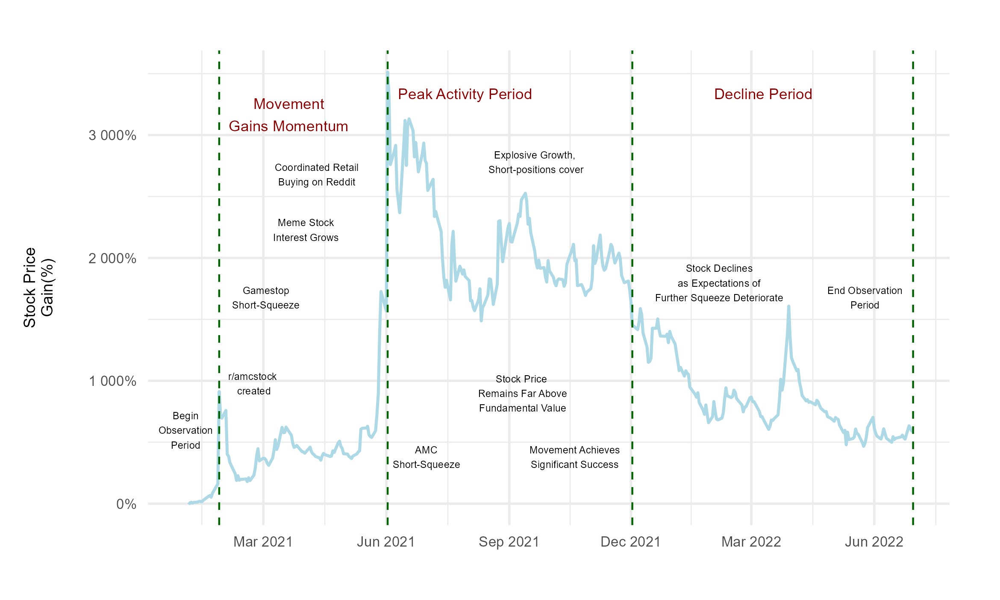
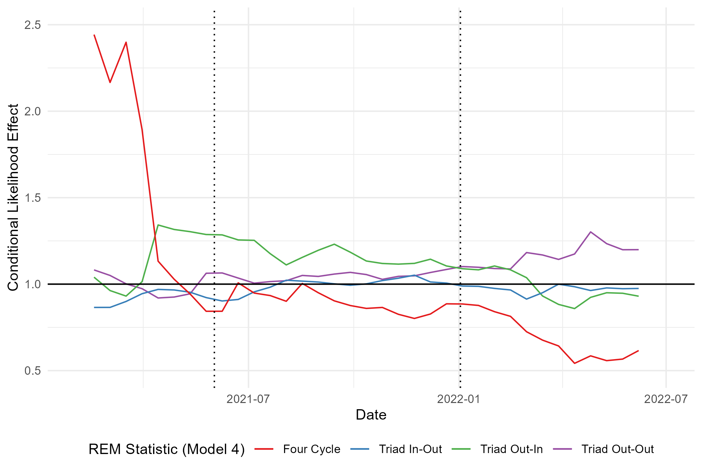
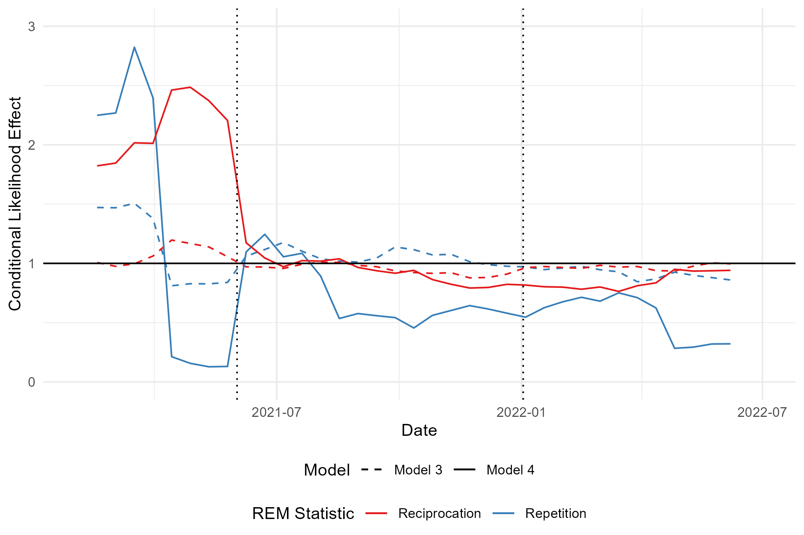

## MSc Dissertation: A Relational Event Model Approach to Online Collective Action

## Objective
This project provides actionable insights into the dynamics of online collective action, offering a framework for analyzing user interactions in large-scale social media networks. 

**Dissertation PDF**: [msc_dissertation.pdf](msc_dissertation.pdf)

## Problem & Context
The 2021 Reddit-driven AMC short squeeze demonstrated the power of online communities to disrupt financial markets. This project analyzes the interaction patterns of Reddit users over 17 months, uncovering the drivers of growth, peak activity, and decline in such movements. These insights are valuable for social media platforms, financial analysts, and marketers aiming to understand or harness collective online behavior. It provides insight into underlying social structures of Internet movements. 

## Key Results
- Identified key predictors of user activity and popularity, showing their staying power in driving online movements.
- Demonstrated that interaction predictors fluctuate significantly in the short term, highlighting the temporary nature of social formations.
- Developed a scalable methodology for analyzing dynamic user bases in large-N networks.

  
  

## Technical Approach
- **Data Source**: Pushshift data dump (2021 Reddit comments and submissions), anonymized, cleaned and parsed.
- **Methods**: Relational Event Models (REM) with case-control sampling and partial likelihood estimation. Sliding window function for time-series analysis. Survival models for final coefficient estimation. 
- **Tools**: Python, R, and the _eventnet_ software for REM statistics.

## Repository Structure
- **eventnet_configs/**: XML configuration files for REM calculations.
- **modeling/**: Scripts for Cox Proportional Hazard models across three stages.
- **network_construction/**: Data filtering and raw data collection scripts, including subreddit-specific extraction tools.
- **visualization/**: Code for generating visuals such as time-series and network structure diagrams.

## Setup Instructions
1. Download the Pushshift data dump from [Academic Torrents](https://academictorrents.com/details/9c263fc85366c1ef8f5bb9da0203f4c8c8db75f4).
2. Install the _eventnet_ software from its [GitHub repository](https://github.com/juergenlerner/eventnet).
3. Follow the scripts in the `network_construction` folder to preprocess the data.
4. Use the `modeling` folder scripts to run REM analyses.
5. Generate visualizations using the scripts in the `visualization` folder.

