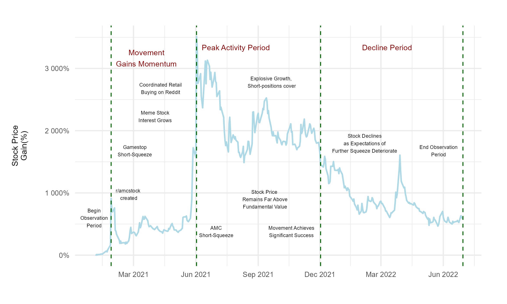
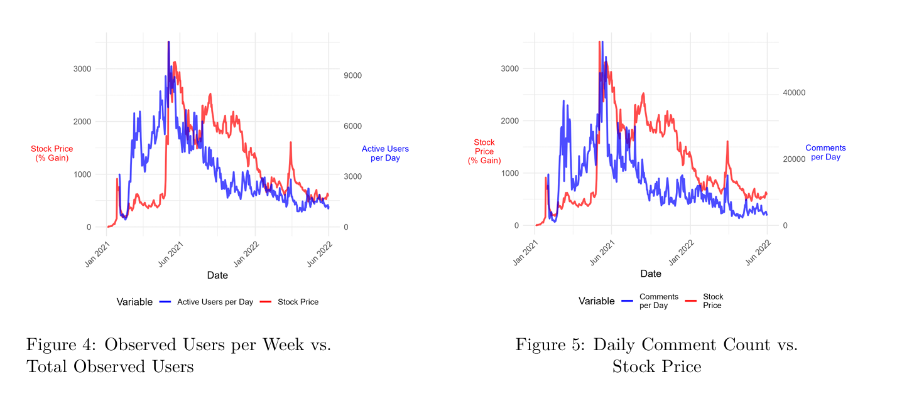
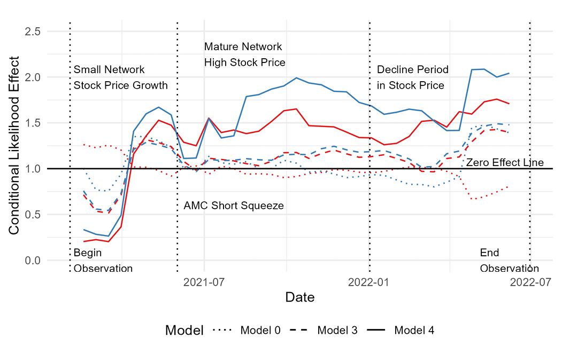
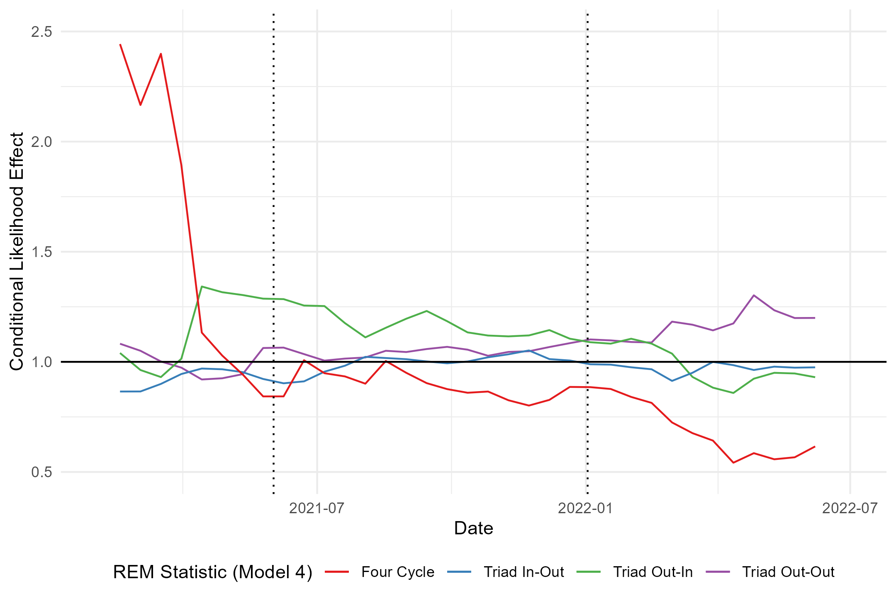
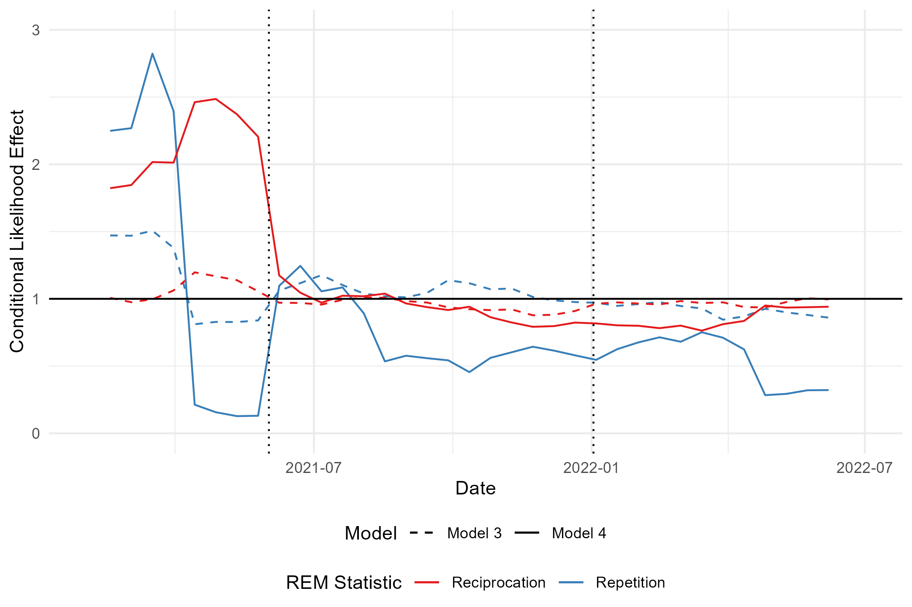
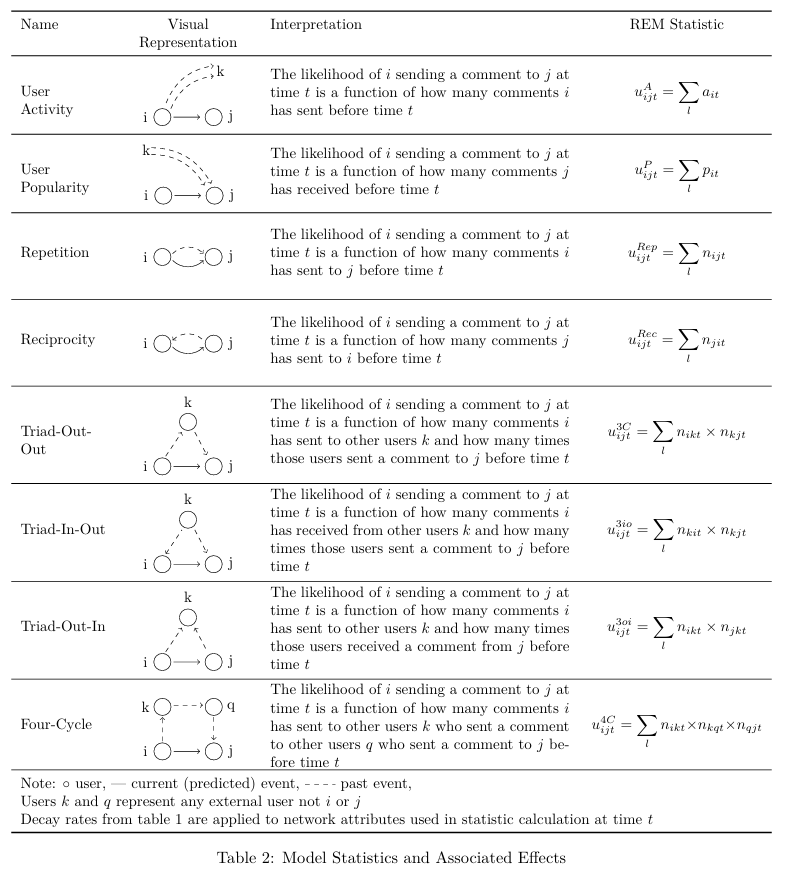
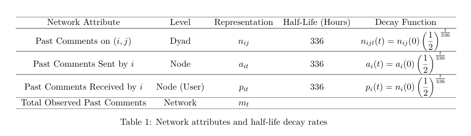
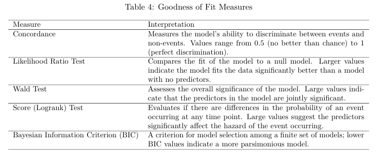
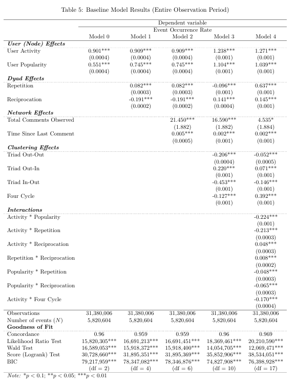

## MSc Dissertation: A Relational Event Model Approach to Online Collective Action

## Objective
This project provides actionable insights into the dynamics of online collective action, offering a framework for analyzing user interactions in large-scale social media networks. 

**Dissertation PDF**: [msc_dissertation.pdf](msc_dissertation.pdf)

## Problem & Context
The 2021 Reddit-driven AMC short squeeze demonstrated the power of online communities to disrupt financial markets. This project analyzes the interaction patterns of Reddit users over 17 months, uncovering the drivers of growth, peak activity, and decline in such movements. These insights are valuable for social media platforms, financial analysts, and marketers aiming to understand or harness collective online behavior. It provides insight into underlying social structures of Internet movements. 

## Key Results
- Identified key predictors of user activity and popularity, showing their staying power in driving online movements.
- Demonstrated that interaction predictors fluctuate significantly in the short term, highlighting the temporary nature of social formations.
- Developed a scalable methodology for analyzing dynamic user bases in large-N networks.

  
  

## Technical Approach
- **Data Source**: Pushshift data dump (2021 Reddit comments and submissions), anonymized, cleaned and parsed.
- **Methods**: Relational Event Models (REM) with case-control sampling and partial likelihood estimation. Sliding window function for time-series analysis. Survival models for final coefficient estimation. 
- **Tools**: Python, R, and the _eventnet_ software for REM statistics.

## Model Specification

At its core the analysis treats every Reddit comment as a **relational event**  
$e_m = (i_m, j_m, t_m)$, i.e. a directed, time-stamped interaction from sender $i_m$ to
receiver $j_m$ at time $t_m$.
For each potential dyad $(i,j)$ in the contemporaneous risk set $R_t$ the **hazard
rate**

$$
\lambda_{ij}(t) = \exp\{\beta^{\top}u_{ij}(t)\}
$$

gives the instantaneous propensity that $i$ will address $j$.
The covariate vector $u_{ij}(t)$ compiles 13 endogenous statistics that
encode past behaviour at the node, dyad and higher-order levels (see below).

Model coefficients $\beta$ are obtained with Cox partial-likelihood
estimation, chosen for its scalability on large event streams.  
To make the computation feasible the full risk set (≈ 12.7 billion
dyads) is thinned with a **1 : 5 case-control sample**, yielding
31 million event/non-event records without inflating coefficient error.

Temporal memory is handled through an **exponential decay kernel** that
lets the influence of any past interaction halve every 336 h
($x(t)=x(0) \cdot (½)^{t/336}$) (see below).

The rule is applied to three fundamental attributes—dyadic interaction
count $n_{ij}$, sender out-degree $a_i$, and receiver in-degree
$p_i$—ensuring that the model emphasises recent activity in a highly
volatile user base.
After decay, raw counts are transformed via $\log(1+p)$ to tame the
heavy-tailed comment distribution and finally z-standardised so that the
resulting coefficients are directly comparable.

Three extensions probe the robustness of this baseline specification:
(i) a **time-varying REM** that interacts each statistic with a sliding
one-month window (35 windows, 14-day stride) to reveal how effects
evolve across the 17-month life-cycle;  
(ii) a **weighted REM** that multiplies event impact by comment length
to test effort-sensitive dynamics; and  
(iii) a **comment-type REM** that fits separate hazard processes for
top-level comments and replies.  Together these variants confirm that
the principal drivers—user activity, popularity, and short-range
reciprocal/triadic reinforcement—are robust to modelling assumptions
while still exhibiting meaningful temporal fluctuation.

Final REM statistics effects are interpreted through a cox proportional hazards model, which estimates the likelihood of an event occurring at a specified point in time. This enables the comparison of coefficient effects over the 17-month observation period of the Reddit case study data.

For a complete explanation of the model pipeline, see page 11 onwards of the dissertation pdf.

## Model Evaluation 

I evaluate goodness of fit with the diagnostics that come “for free” from the Cox proportional-hazards estimation. Although not tailored to REMs, these statistics quantify how well the estimated hazard distinguishes observed events from sampled non-events and how closely the predicted event order mirrors the real sequence—providing a practical, if approximate, gauge of model adequacy. Evaluating REM models is an ongoing area of study in the literature, so this adapts to what is currently possible with existing network approaches.

## Repository Structure
- **eventnet_configs/**: XML configuration files for REM calculations.
- **modeling/**: Scripts for Cox Proportional Hazard models across three stages.
- **network_construction/**: Data filtering and raw data collection scripts, including subreddit-specific extraction tools.
- **visualization/**: Code for generating visuals such as time-series and network structure diagrams.

## Setup Instructions
1. Download the Pushshift data dump from [Academic Torrents](https://academictorrents.com/details/9c263fc85366c1ef8f5bb9da0203f4c8c8db75f4).
2. Install the _eventnet_ software from its [GitHub repository](https://github.com/juergenlerner/eventnet).
3. Follow the scripts in the `network_construction` folder to preprocess the data.
4. Use the `modeling` folder scripts to run REM analyses.
5. Generate visualizations using the scripts in the `visualization` folder.

## Appendix

Full baseline model results coefficient table.

